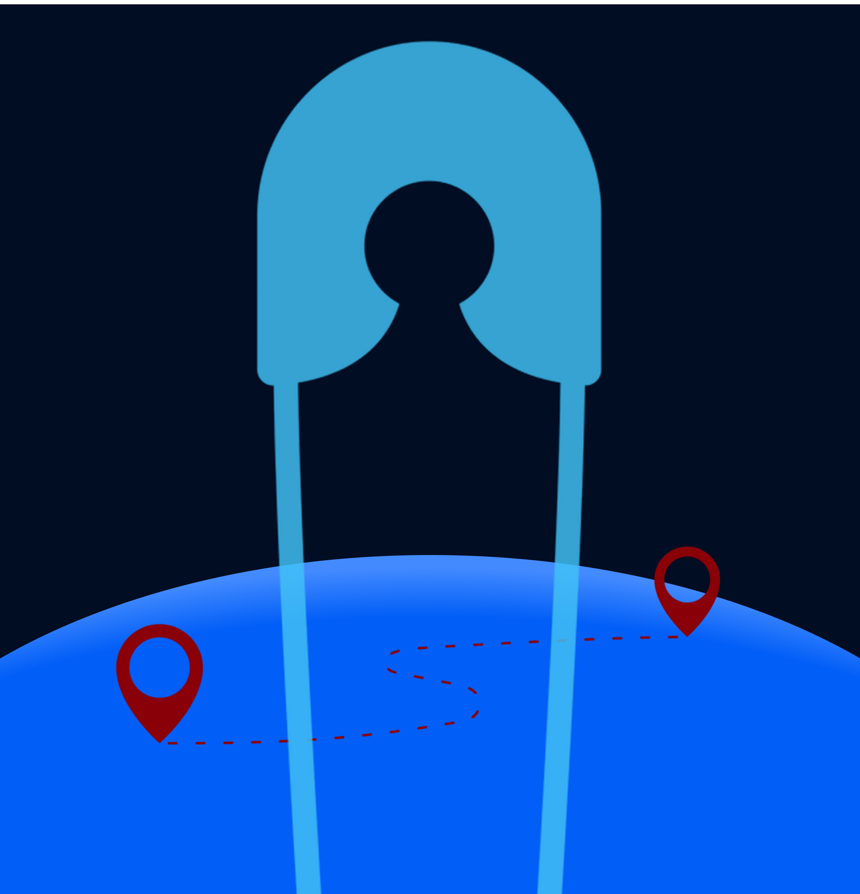
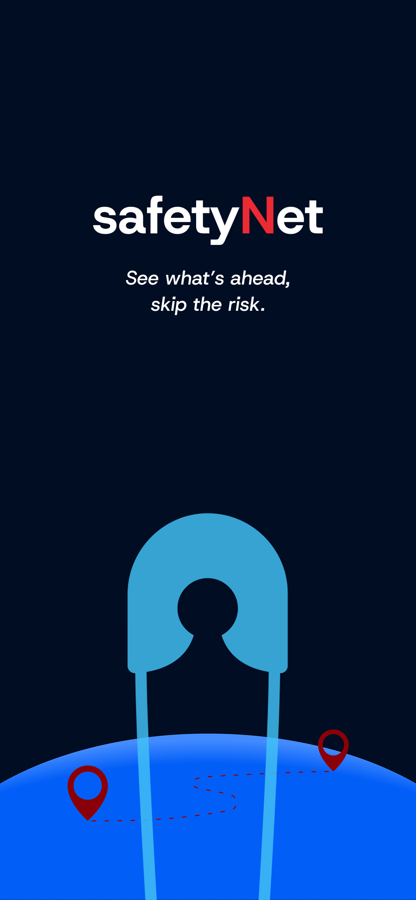
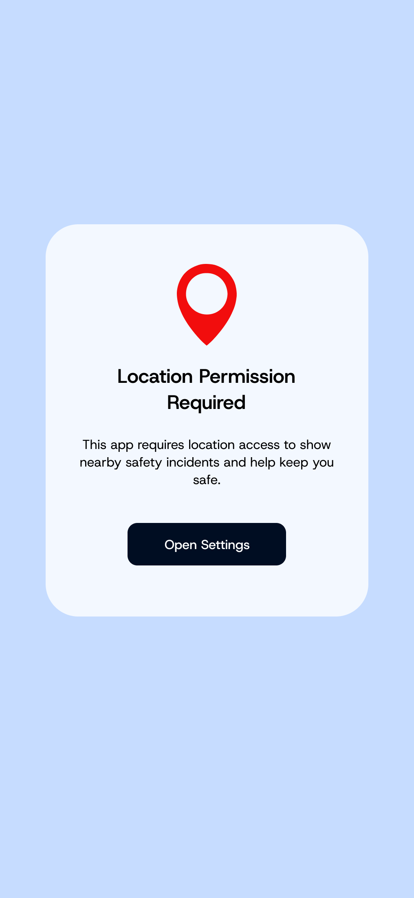
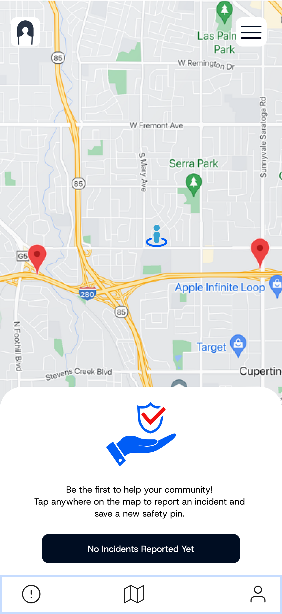
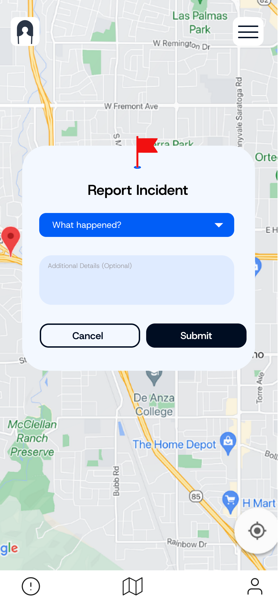

<div align="center">

# 🛡️ SafetyNet

### *Navigate Safely. Report Responsibly. Empower Your Community.*

<p align="center">
  
</p>

**A crowd-sourced safety navigation app that helps users travel from A to B while avoiding high-risk areas through real-time incident reporting.**

[](https://kotlinlang.org/)
[](https://developer.android.com/jetpack/compose)
[](LICENSE)

[Features](#-features) • [Architecture](#-architecture) • [Screenshots](#-screenshots) • [Setup](#-installation)

</div>

---

## 🎯 Problem Statement

Traditional navigation apps show traffic conditions, but what about **safety conditions**? SafetyNet fills this gap by creating a **community-driven safety map** where users can report and view incidents in real-time, making informed decisions about their routes.

> **Gender-neutral. Community-powered. Safety-first.**

---

## Screenshots

<p align="center">
  
  
  
  
</p>

---

## Features

<table>
<tr>
<td width="50%" valign="top">

### **Interactive Safety Map**
- Real-time GPS location tracking
- Color-coded incident markers
  - 🔴 **High Risk** (Assault, Robbery)
  - 🟠 **Medium Risk** (Harassment, Theft)
  - 🟡 **Low Risk** (Suspicious Activity)
  - 🟢 **Safe** (Well-lit, Patrolled)
- Smart 5km radius filtering
- Auto-centering on user location

</td>
<td width="50%" valign="top">

### **Incident Reporting**
- Tap-to-report interface
- Dropdown incident type selection
- Detailed description fields
- Severity-based categorization
- Timestamp & location metadata

</td>
</tr>
<tr>
<td width="50%" valign="top">

### **Smart Detection**
- Duplicate filtering (50m radius)
- Distance-based sorting
- Severity + proximity algorithm
- Real-time data synchronization

</td>
<td width="50%" valign="top">

### 💾 **Offline-First**
- Local Room database
- Persistent incident storage
- CRUD operations
- Works without internet

</td>
</tr>
</table>

---

## Architecture

Built with **Clean Architecture** principles for scalability and maintainability:
```
┌─────────────────────────────────────────────────────┐
│           UI Layer (Jetpack Compose)                │
│  ┌────────────┐  ┌─────────────┐  ┌─────────────┐   │
│  │  MapScreen │  │ ReportDialog│  │ IncidentList│   │
│  └────────────┘  └─────────────┘  └─────────────┘   │
└────────────────────┬────────────────────────────────┘
                     │
┌────────────────────▼────────────────────────────────┐
│         Domain Layer (Business Logic)               │
│  ┌──────────────────────────────────────────────┐   │
│  │  Use Cases: AddIncident, GetNearbyIncidents  │   │
│  └──────────────────────────────────────────────┘   │
└────────────────────┬────────────────────────────────┘
                     │
┌────────────────────▼────────────────────────────────┐
│          Data Layer (Repository Pattern)            │
│  ┌────────────────┐        ┌────────────────────┐   │
│  │ Local (Room DB)│  ←→    │ Remote (Firebase)  │   │
│  └────────────────┘        └────────────────────┘   │
└─────────────────────────────────────────────────────┘
```

### Tech Stack

<div align="center">

| Category | Technology |
|:--------:|:----------:|
| **Language** |  |
| **UI Framework** |  |
| **Architecture** |  |
| **Dependency Injection** |  |
| **Database** |  |
| **Maps** |  |
| **Backend** |   |
| **Documentation** |  |

</div>

---

## Security & Privacy

- **Location Privacy**: GPS data never leaves device without user consent
- **Anonymous Reporting**: Optional identity protection
- **Data Encryption**: All sensitive data encrypted at rest
- **No Tracking**: Zero analytics or user behavior tracking

---

## Roadmap
```
Q1 2025
├── ✅ Core incident reporting
├── ✅ Interactive map with clustering
├── ✅ Offline-first architecture
└── 🔄 Firebase integration (In Progress)

Q2 2025
├── Route optimization avoiding high-risk areas
├── Push notifications for nearby incidents
├── Community verification system
└── Heatmap visualization

Future
├── Multi-language support
├── Safety analytics dashboard
├── AI-powered incident prediction
└── Integration with local authorities
```

---

## Installation
```bash
# Clone the repository
git clone https://github.com/yourusername/safetynet.git

# Navigate to project directory
cd safetynet

# Add your Google Maps API key in local.properties
echo "MAPS_API_KEY=your_api_key_here" >> local.properties

# Add google-services.json from Firebase Console
# Place in app/ directory

# Build the project
./gradlew build

# Run on device/emulator
./gradlew installDebug
```

**Requirements:**
- Android Studio Hedgehog | 2023.1.1+
- Minimum SDK: 24 (Android 7.0)
- Target SDK: 34 (Android 14)
- JDK 17+

---

## Testing
```bash
# Run unit tests
./gradlew test

# Run instrumented tests
./gradlew connectedAndroidTest

# Generate coverage report
./gradlew jacocoTestReport
```

---

## Documentation

Comprehensive KDoc documentation available. Generate docs:
```bash
./gradlew dokkaHtml
```

View at: `build/dokka/html/index.html`

---

## 🤝 Contributing

Contributions are welcome! Please follow these steps:

1. Fork the repository
2. Create your feature branch (`git checkout -b feature/AmazingFeature`)
3. Commit your changes (`git commit -m 'Add some AmazingFeature'`)
4. Push to the branch (`git push origin feature/AmazingFeature`)
5. Open a Pull Request

Please read [CONTRIBUTING.md](CONTRIBUTING.md) for details on our code of conduct.

---

## 📄 License

This project is licensed under the MIT License - see the [LICENSE](LICENSE) file for details.

---

**Built with ❤️ for safer communities**
[](https://github.com/yourusername/safetynet/issues)

⭐ **Star this repo if you find it useful!** ⭐

</div>
